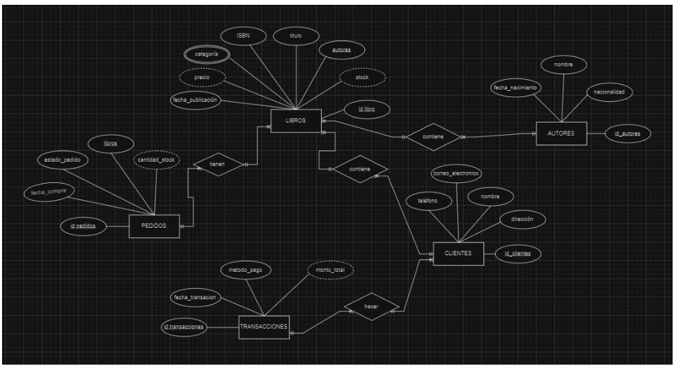

# 📚 Librería El Mundo de Sofía  

Proyecto de base de datos para la gestión de una librería, donde se administran inventario, ventas y clientes mediante un modelo relacional.  


---

##  Tabla de Contenidos  

1. [Introducción](#introducción)  
2. [Caso de Estudio](#caso-de-estudio)  
3. [Planificación](#planificación)  
4. [Construcción del Modelo Conceptual](#construcción-del-modelo-conceptual)  
   - [Descripción](#descripción)  
   - [Gráfica](#gráfica)  
5. [Construcción del Modelo Lógico](#construcción-del-modelo-lógico)  
   - [Descripción](#descripción-1)  
   - [Gráfica](#gráfica-1)  
6. [Normalización del Modelo Lógico](#normalización-del-modelo-lógico)  
   - [Primera Forma Normal (1FN)](#primera-forma-normal-1fn)  
   - [Segunda Forma Normal (2FN)](#segunda-forma-normal-2fn)  
   - [Tercera Forma Normal (3FN)](#tercera-forma-normal-3fn)  
7. [Construcción del Modelo Físico](#construcción-del-modelo-físico)  
   - [Descripción](#descripción-2)  

---

## Introducción  

**Librería El Mundo de Sofía** es un proyecto de base de datos diseñado para **gestionar inventario, ventas y clientes** en una tienda de libros.  
La base de datos permitirá:  

✔ Registrar y gestionar **libros, autores, clientes, pedidos y transacciones**.  
✔ Representar la estructura de datos mediante un **diagrama UML E-R**.  
✔ Implementar relaciones y restricciones entre las tablas.  

---

##  Caso de Estudio  

Para la **Librería El Mundo de Sofía**, se creará una **base de datos** que gestionará:  

**Inventario** de libros.  
 **Registros** de clientes y autores.  
**Pedidos y transacciones de compra**.  
 **Relaciones** entre las diferentes entidades.  

Se utilizará un **diagrama UML E-R** para evidenciar la estructura y relaciones de la base de datos.  

---

## Descripcion

### Construcción del Modelo Conceptual  

**Entidades y atributos:**  

| Entidad     |  Atributos |
|--------------|--------------------------------------------------|
| **LIBROS** | id_libro, título, id_autor, editorial, categoría, fecha_publicación, ISBN, precio, stock. |
| **AUTORES** | id_autor, nombre, fecha_nacimiento, nacionalidad. |
| **CLIENTES** | id_cliente, nombre, correo_electrónico, teléfono, dirección. |
| **PEDIDOS** | id_pedido, id_libro, cantidad_stock, fecha_compra, estado_pedido. |
| **TRANSACCIONES** | id_transaccion, metodo_pago, monto_total, fecha_transaccion. |

**Relaciones entre las entidades:**  

| Relación | Cardinalidad |
|---------|-------------|
| Libros - Autores | 1:N |
| Libros - Clientes | N:1 |
| Clientes - Transacciones | N:1 |
| Libros - Pedidos | 1:N |

###  Gráfica del Modelo Conceptual  
 **Diagrama UML E-R:**  


 

---

##  Construcción del Modelo Lógico  
 **Estructura del modelo lógico:**  

|  Entidad |  Descripción |
|-----------|------------------------------------------------------------|
| **LIBROS** | Incluye ID_libro (PK), id_autor (FK), editorial, categoría, ISBN, precio, stock. |
| **AUTORES** | Incluye id_autor (PK), nombre, fecha_nacimiento, nacionalidad. |
| **CLIENTES** | Incluye id_cliente (PK), nombre, correo_electrónico, teléfono, dirección. |
| **PEDIDOS** | Incluye id_pedido (PK), id_libro (FK), cantidad_stock, fecha_compra, estado_pedido. |
| **TRANSACCIONES** | Incluye id_transaccion (PK), metodo_pago, monto_total, fecha_transaccion. |

###  Gráfica del Modelo Lógico  
**Diagrama del Modelo Lógico:**  

 

---

##  Normalización del Modelo Lógico  

**Primera Forma Normal (1FN)**  
✔ Todos los atributos tienen valores atómicos.  
✔ No existen grupos repetidos de datos.  


 **Segunda Forma Normal (2FN)**  
✔ Debe cumplir con 1FN.  
✔ Cada atributo de la tabla depende completamente de la clave principal.  
 

**Tercera Forma Normal (3FN)**  
✔ Debe cumplir con 2FN.  
✔ No deben existir atributos no principales que dependan transitivamente de la clave.  


---

##  Construcción del Modelo Físico  

 **Conversión de entidades en tablas y columnas:**  

```sql
CREATE TABLE Libros (
    id_libro INT PRIMARY KEY,
    titulo VARCHAR(255),
    id_autor INT,
    editorial VARCHAR(255),
    categoria VARCHAR(100),
    fecha_publicacion DATE,
    ISBN VARCHAR(20),
    precio DECIMAL(10,2),
    stock INT,
    FOREIGN KEY (id_autor) REFERENCES Autores(id_autor)
);
```
## Creditos 

Elaborado por Zully Fernanda Ortiz Avendaño Cc. 1092528097